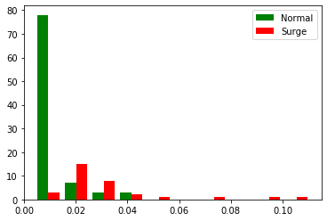

# Uber Driver Income Analysis:

# Summary:
There is an intense debate about the income of Uber drivers. Many researchers are presenting their analysis and saying that Uber driver makes 3.50 to 10.00 dollars per hours. On the other hand, Uber company claiming that their driver makes more than 70 thousand per year if they work full time. 
Here I have completed the Exploratory Data Analysis to uncover the hidden truth about the uber driver income. This project includes the following steps:

1)	Exploratory Data Analysis:

    1)	Checking the types of data:
    2)	Dropping irrelevant columns:
    3)	Renaming the columns:
    4)	Dropping the duplicate rows:
    5)	Dropping the missing or null values:
    6)	Detecting outliers:
    
2)	Data visualization:
3)	Identifying the relationships between variables:
4)	Hypothesis testing:
5)	Performing Linear regression for income prediction:

# Built With:
1) Anaconda Environment
2) Jupyter Notebook
3) Python libraries
